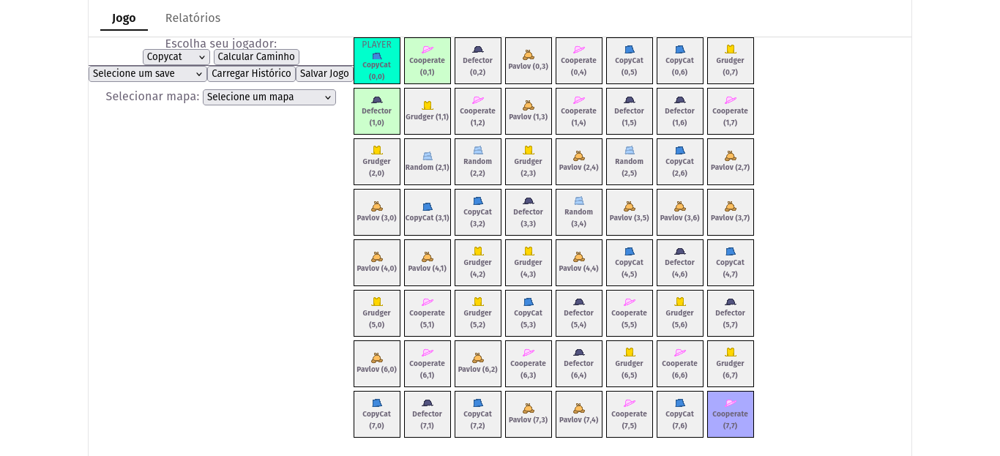
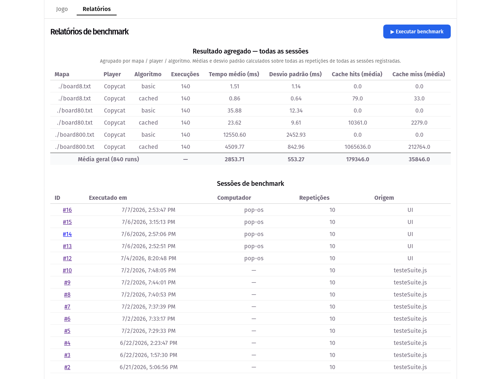

<div align="center">


<br/><br/>

# 🎩 Game Theory Simulator

**Instituto Federal Catarinense — Campus Blumenau**

Bacharelado em Ciência da Computação · Programação Orientada a Objetos II

[](https://github.com/Ariel-Alejandr0/game-theory-sim)
[](https://developer.mozilla.org/en-US/docs/Web/JavaScript)
[](https://react.dev)
[](https://nodejs.org)

</div>

---

## 📋 Sobre o Projeto

Simulador de Teoria dos Jogos com pathfinding em grade, desenvolvido como trabalho da disciplina de **Programação Orientada a Objetos II** do curso de **Bacharelado em Ciência da Computação** do IFC Campus Blumenau.

O projeto modela um agente que navega por um tabuleiro usando o algoritmo **A\*** (A-Star), travando batalhas com adversários ao longo do caminho. Cada adversário adota uma estratégia diferente do Dilema do Prisioneiro, tornando o comportamento de cada caminho único dependendo da estratégia escolhida.

O sistema também inclui um módulo de **benchmark** completo com persistência em banco de dados e visualização de relatórios com gráficos comparativos.

---

## 🎮 Funcionalidades

- **Tabuleiro interativo** — navegação por clique com visualização do caminho calculado
- **Pathfinding A\*** — algoritmo básico e versão com cache de batalhas
- **6 estratégias de jogo** — cada uma com identidade visual própria (chapéu sprite)
- **Salvamento de partidas** — histórico de jogos com possibilidade de retomar
- **Seleção de mapas** — mapas pré-definidos com diferentes tamanhos e complexidades
- **Benchmark automatizado** — suite de testes que mede desempenho por estratégia, mapa e algoritmo
- **Relatórios com gráficos** — comparação entre algoritmos com tempo médio, desvio padrão e taxa de cache hit

---

## 🧠 Estratégias Implementadas

| Chapéu | Estratégia | Comportamento |
|--------|-----------|---------------|
| 🔵 Fez azul | **Copycat** | Imita a última jogada do oponente |
| 🎩 Escuro | **Defector** | Sempre trai |
| 🌸 Aba larga | **Cooperate** | Sempre coopera |
| 💛 Cartola | **Grudger** | Coopera até ser traído, depois trai para sempre |
| 🟤 Caçador | **Pavlov** | Repete a jogada se venceu, muda se perdeu |
| 🩵 Boné | **Random** | Joga aleatoriamente |

---

## 📊 Benchmark

O módulo de benchmark compara os algoritmos **basic** e **cached** do A\* em mapas de diferentes tamanhos (`board8`, `board80`, `board800`), registrando:

- Tempo médio de execução (ms)
- Desvio padrão entre repetições
- Taxa de acerto de cache (`cacheHits / (cacheHits + cacheMisses)`)
- Nós expandidos e batalhas testadas

Os resultados são salvos em banco de dados SQLite via Prisma e exibidos na tela de relatórios.

---

## 🖥️ Screenshots

<!-- 
  👉 INSTRUÇÕES:
  - Adicione prints do sistema na pasta docs/
  - Substitua os comentários abaixo pelas imagens correspondentes
-->

**Tabuleiro principal**



**Relatórios de benchmark**



---

## 🎬 Vídeo de Demonstração

<!-- 👉 Substitua a URL abaixo pelo link do seu vídeo após publicar -->

[](URL_DO_VIDEO_AQUI)

> O vídeo inclui o link para este repositório: https://github.com/Ariel-Alejandr0/game-theory-sim

---

## 🚀 Como Executar

### Pré-requisitos

- [Node.js 20+](https://nodejs.org)
- npm

### 1. Clone o repositório

```bash
git clone https://github.com/Ariel-Alejandr0/game-theory-sim.git
cd game-theory-sim/game-theory-sim
```

### 2. Configure o projeto

O script abaixo instala automaticamente todas as dependências do frontend e do backend, além de configurar o banco de dados.

```bash
chmod +x scripts/setup.sh
./scripts/setup.sh
```

### 3. Inicie a aplicação

O script inicia simultaneamente o backend e o frontend.

```bash
chmod +x scripts/start.sh
./scripts/start.sh
```

Após a inicialização, acesse:

- **Frontend:** http://localhost:5173
- **Backend:** http://localhost:3001

### 4. (Opcional) Execute o benchmark

```bash
cd src/game/benchmark
node testeSuite.js
```

Os resultados ficam disponíveis na aba **Relatórios** da interface.

### Pré-requisitos

- [Node.js 20+](https://nodejs.org)
- npm

### 1. Clone o repositório

```bash
git clone https://github.com/Ariel-Alejandr0/game-theory-sim.git
cd game-theory-sim/game-theory-sim
```

### 2. Instale as dependências

```bash
npm install
```

### 3. Configure o banco de dados

```bash
cd src/server
npx prisma db push
```

### 4. Inicie o servidor

```bash
# dentro de src/server
node index.js
```

O servidor sobe em `http://localhost:3001`.

### 5. Inicie o frontend

Abra um novo terminal:

```bash
# na raiz game-theory-sim/game-theory-sim
npm run dev
```

Acesse `http://localhost:5173` no navegador.

### 6. (Opcional) Rode o benchmark

```bash
cd src/game/benchmark
node testeSuite.js
```

Os resultados ficam disponíveis na aba **Relatórios** da interface.

---

## 🛠️ Tecnologias

| Camada | Tecnologia |
|--------|-----------|
| Frontend | React 18 + Vite |
| Roteamento | React Router DOM |
| Gráficos | Recharts |
| Backend | Node.js + Express |
| ORM | Prisma |
| Banco de dados | SQLite |
| Algoritmo | A\* (basic e cached) |

---

## 👤 Autor

Desenvolvido por **Ariel Alejandro** — estudante de BCC no IFC Campus Blumenau.

[](https://github.com/Ariel-Alejandr0)

---

<div align="center">
  <sub>IFC Campus Blumenau · BCC · POO2 · 2026</sub>
</div>